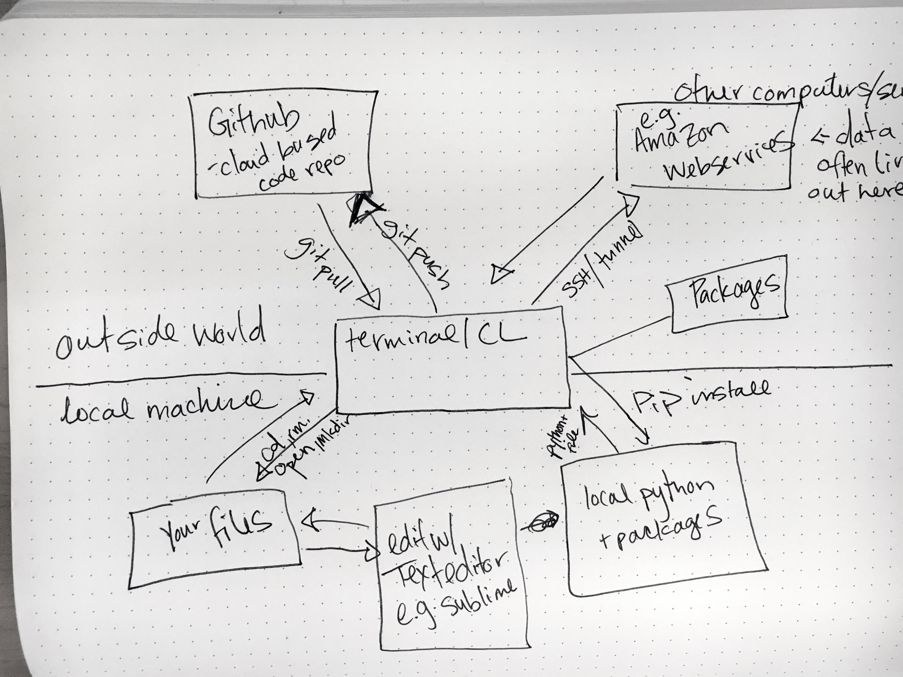

#  Flex lesson
DS | Lesson 5
> Instructor Note: Feel free to run this workshop earlier, as needed

### LEARNING OBJECTIVES
*After this lesson, you will be able to:*

-  Identify the data science toolkit
-  Navigate Git and the Command Line
-  Describe Probability vs Odds

### STUDENT PRE-WORK
*Before this lesson, you should already be able to:*

- Explain the difference between variance and bias  
- Use descriptive stats to understand your data

### INSTRUCTOR PREP
*Before this lesson, instructors will need to:*

- Determine which sections of this flex lesson are applicable for their class
- Copy and modify the [lesson slide deck](./assets/slides/slides-5.md) as needed
- Add to the "Additional Resources" section for this lesson
- _Optional: Prep for the Github Lesson_
	- Draw the skeleton (boxes without content) of the landscape.jpg on the white board.
	- Fill it in as you talk through the different features.
	- Write commands (e.g., git push and git pull) on the lines connecting the correct tool to CL/Terminal as you discuss each one.

> A notebook of [data visualization exercises](./code/Data Visualization Lab.ipynb
) is available.

### LESSON GUIDE

| TIMING  | TYPE  | TOPIC  |
|:-:|---|---|
| 5 min  | [Opening](#opening)  | Lesson Objectives  |
| 5 min  | [Introduction](#introduction1)   | Common Data Science Tools|
| 10 min | [Command Line Demo](#demo1) | Command Line Demo |
| 10 min | [Text Editor Demo](#demo2) | Text Editor Demo |
| 10 min | [iPython Notebook](#intro2) | iPython Notebooks |
| 10 min | [Git Tools](#intro3) | Intro to Git |
| 50 min  | [Independent Practice](#lab1)  | GIT and CL |
| 5 min  | [Introduction](#intro4)   | Odds and Probability |
| 20 min  | [Guided Practice](#guided-practice) | Hand calcs |
| 15 min  | [Wrap-up](#wrapup)  | Review Guided Practice|


---
<a name="opening"></a>
## Opening (5 min)
- Review Current Lesson Objectives


<a name="introduction"></a>
## Intro: Tools of the Trade (10 mins)
Today we are going to review some of the tools we use in data science and see how they fit into the wider programming environment.

*Command line*- This is your portal to your computer and the outside world.

> Instructor note: Walk through the bottom half of this diagram:
.

### Local machine
On your local machine you have a variety of tools at your disposal, including:

1. Text editor
2. Programs/Packages/Tools
3. Your files

All of these can be accessed through terminal and many can also be accessed through a _GUI_, or Graphical User Interface.

Let's take a look at the file directory system through finder and then through terminal. Pull up the class folder on Finder. Then navigate to the same folder via terminal.

<a name="demo1"></a>
## Command Line Demo
Demo a few commands-

1. `cd`
2. `pwd`
3. `$home`
4. `mkdir`
5. `open`

As we mentioned, we can access many tools with terminal. Let's walk through a few that are important for data science.

So far we've been using iPython notebook in place of a text editor. However, there are lots of other options available, including: Emacs, Vim, Sublime.

**Check**: What is a text editor? Can you name any other examples?

<a name="demo2"></a>
## Text Editor - Sublime

Let's do a demo of Sublime with python.

> Instructor Note: Pull up the text editor and demo writing a simple python program. You can use [say-hi.py ](./code/say-hi.py).

<a name="intro2"></a>
## iPython Notebook
Where does IPython Notebook fit in?

From the iPython Notebook docs-
	"The notebook extends the console-based approach to interactive computing in a qualitatively new direction, providing a web-based application suitable for capturing the whole computation process: developing, documenting, and executing code, as well as communicating the results.

iPython notebooks combine two components:

- A web application: a browser-based tool for interactive authoring of documents which combine explanatory text, mathematics, computations and their rich media output.

- Notebook documents: a representation of all content visible in the web application, including inputs and outputs of the computations, explanatory text, mathematics, images, and rich media representations of objects."

As you just saw, terminal allows us to run programs such as python or javascript (node). It also allows us to reach out to the outside world and add packages we may need.

When we do this with python we often use a tool called _pip_. Let's pip install a package. We could do this with a GUI, but the best way is to use the CL.

Here we will checkout a popular [Python Library, Beautiful Soup](http://www.crummy.com/software/BeautifulSoup/bs4/doc/#installing-beautiful-soup):

```python
pip install beautifulsoup4
```

#### Outside World
As we saw with pip, the CL can connect us to the outside world. In data this is particularly important.

Let's say we have HIPAA protected data (note: HIPAA is a policy that protects health data for people. It requires extra security so you can't leave data around on your local computer.) Often times it will be the data we'll leave on an external computer that we need to communicate with. We can do this through the CL.

> Instructor Note: Demo SSH and/or Tunnel to a AWS or similar instance

Ok! so we've see a few of the ways that we can use terminal to enable our data analysis and help make it more powerful.

Now lets talk about a tool that make version control much easier.

<a name="intro3"></a>
### Intro to Git

Git is a way of tracking changes we've made to our programs and go back in time to fix errors. It is also a powerful tool for collaborating with colleagues allowing you to work on different aspects of the project simultaneously and merge all the changes together seamlessly. Let's see how it works. There are lots of ways to use git one common tool is Github (it's a way of sharing your code with others on your team or with the world).

Let's see it in action. As I'm sure you've guessed, a common way to do this is through CL! You can also use the github GUI.

> Instructor Note: Demo making a small change to [say-hi.py](./code/say-hi.py) (e.g. change howdy to hello). Save it.

```
git add
git commit
git push
```

When a colleague wants to implement our change, they can use a command called `git pull`.

> Instructor Note: _Draw this new connection on the board._

Ok! That was a lot of material. Let's review.

**Check:**
1. What are the big advantages of using CL?
>	- speed
	- connection with outside world
	- flexibility

2. What's a GUI?
>	- Graphical user interface (e.g. finder vs terminal )

3. Will I destroy my computer if I use terminal?
>	- NOPE! ...Although you should be careful with the `sudo` command and cautious when deleting files with `rm`


<a name="#lab1"></a>
## Independent Practice- GIT and Command Line (50 min)
> Instructor Note - Review any of the following exercises from the course pre-work
- "Codecademy" Python module
- GA Command Line

**Alternative Resources:**

- [Github Challenges](https://try.github.io/levels/1/challenges/1)
- [Python the Hard Way](http://learnpythonthehardway.org/book/appendixa.html)
- [Codecademy Command Line](https://www.codecademy.com/learn/learn-the-command-line)


<a name="intro4"></a>
## Introduction: Odds and Probability
How proficient are you with statistical odds? Let's review some quick basics about odds and probability so you can test your familiarity with these concepts.

<a name="guided-practice"></a>
## Guided Practice- Odds and Probability (20 min)
> Instructor Note: Walk through [starter code](./code/starter-code/starter-code-5.ipynb) with students.


<a name="wrapup"></a>
## Review (5-15 mins)

- What did we cover today?
- What are some common data science tools?
- Why are these tools useful?
- What questions do you have?

***

### BEFORE NEXT CLASS
|   |   |
|---|---|
| **PROJECT**  |  TBA |

### ADDITIONAL RESOURCES
- If any
