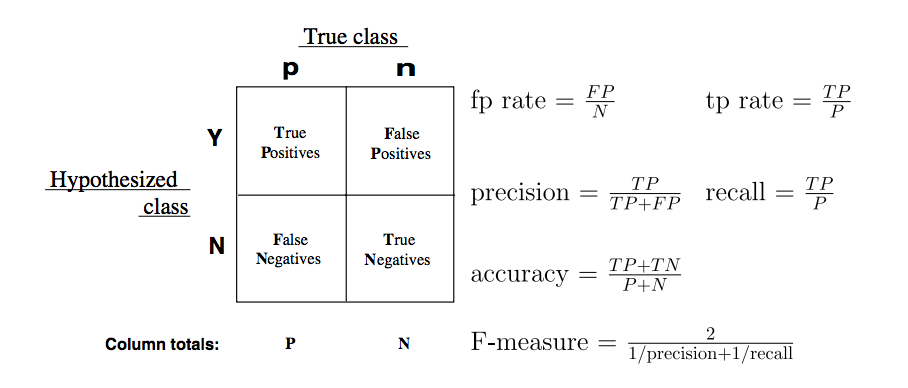
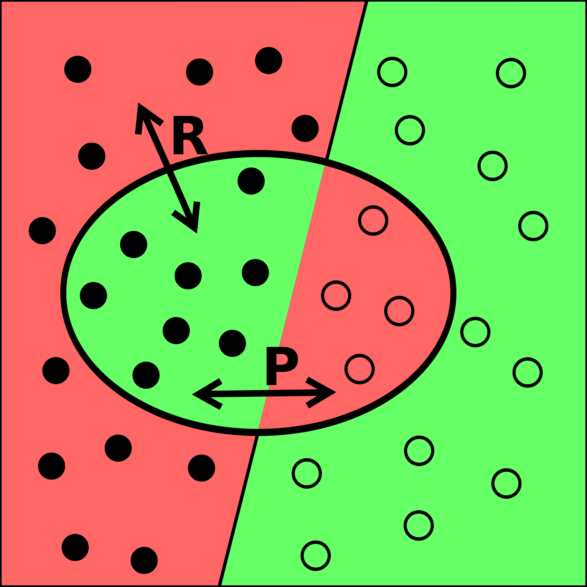
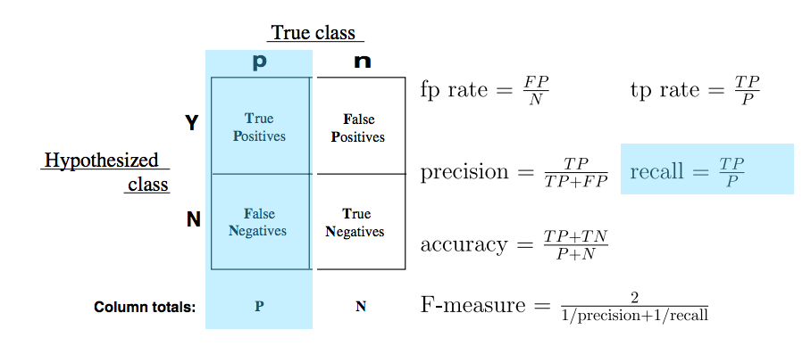
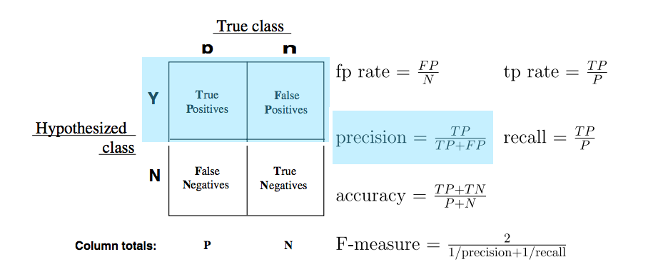
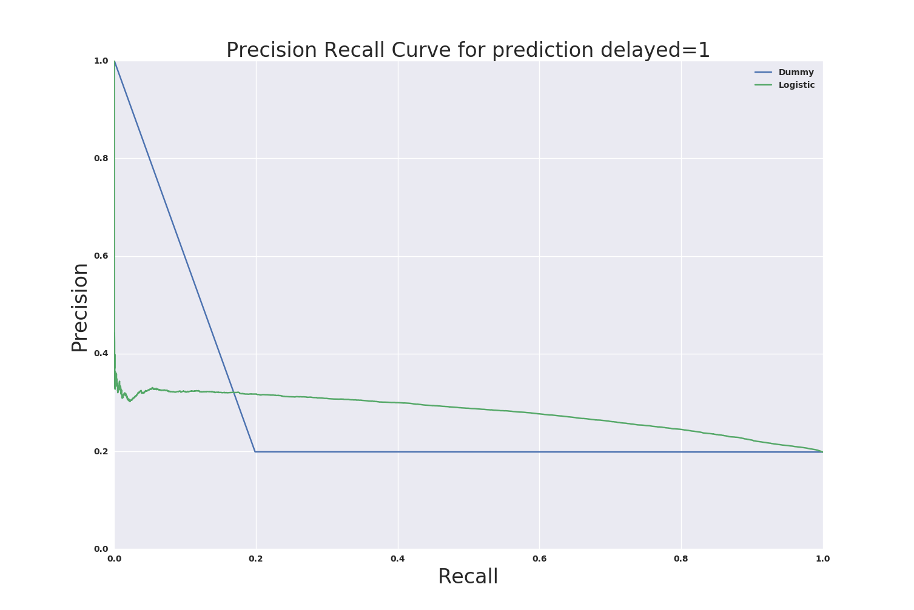
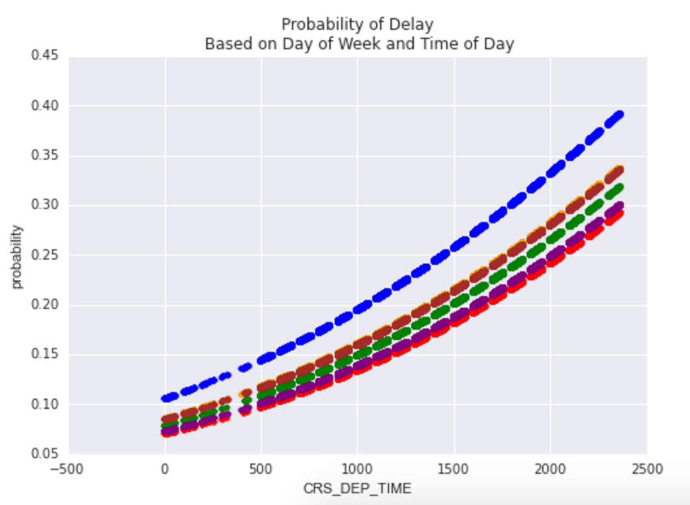
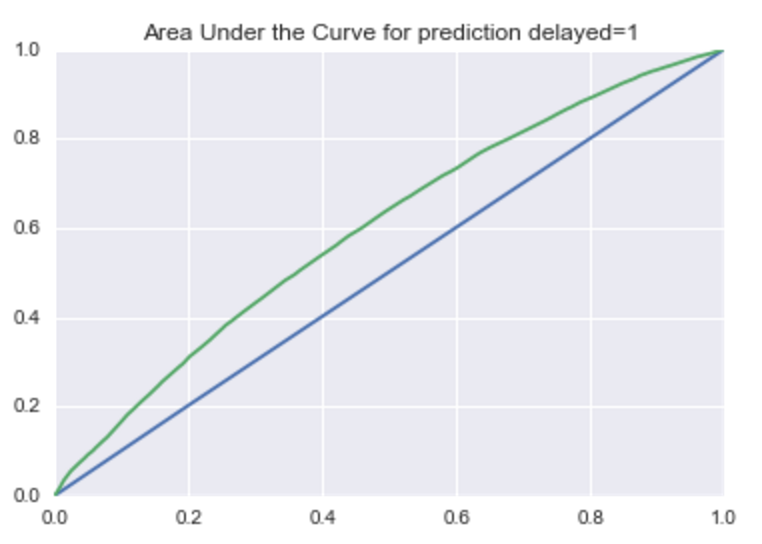

#  Communicating Results
DS | Lesson 10

### LEARNING OBJECTIVES
*After this lesson, you will be able to:*

- Explain the trade-offs between the precision and recall of a model while articulating the cost of false positives vs. false negatives.
- Describe the difference between visualization for presentations vs. exploratory data analysis
- Identify the components of a concise, convincing report and how they relate to specific audiences/stakeholders

### STUDENT PRE-WORK
*Before this lesson, you should already be able to:*

- Understand results from a confusion matrix, and measure true positive rate and false positive rate
- Create and interpret results from a binary classification problem
- Know what a decision line is in logistic regression

### INSTRUCTOR PREP
*Before this lesson, instructors will need to:*

- Review [Unit Project 4](../../projects/unit-projects/project-4/README.md)
- Copy and modify the [lesson slide deck](./assets/slides/slides-10.md)
- Read through datasets and starter/solution code
- Add to the "Additional Resources" section for this lesson

### LESSON GUIDE
| TIMING  | TYPE  | TOPIC  |
|:-:|---|---|
| 5 min  | [Opening](#opening) | We Built A Model |
| 10 min  | [Introduction](#intro-confusion-matrix) | Back to the Confusion Matrix |
| 15 min  | [Introduction](#intro-precision-recall) | Precision and Recall |
| 15 min  | [Demo](#demo-tradeoff) | Understanding Tradeoff |
| 15 min  | [Guided Practice](#guided-practice-cba) | Cost Benefit Analysis |
| 15 min  | [Introduction](#intro-work) | Showing Work |
| 50 min  | [Guided Practice](#guided-practice-models) | Visualizing Models Over Variables |
| 45 min  | [Independent Practice](#ind-practice-projects) | Project Practice |
| 5 min  | [Conclusion](#conclusion) | Review and Next Steps |

---

<a name="opening"></a>
## Opening: We Built A Model (5 mins)
#### We built a model! Now what?

Congrats! You've been building models. But now there is a major stepping stone between your Jupyter notebooks, some matplotlib figures, and the inevitable PowerPoint that will be presented in front of your colleagues.

Classes so far have heavily focused on two core concepts: developing consistent practice with pandas, matplotlib, and sklearn, and interpreting metrics that help evaluate the performance of models. But what does this really mean to the end user? Imagine user responses to some of the following statements:

1. The predictive model I built has an accuracy of 80%.
2. The logistic regression was optimized with L2 regularization, so you know it's good.
3. Gender was more important than age in the predictive model because it had a larger coefficient.
4. Here's the AUC chart that shows how well the model did.

How might your stakeholders respond? How would you respond back?

In a business setting, you are often the only person who can interpret what you've built. While some people may be familiar with basic data visualizations, by and large you will need to do a lot of "hand holding," especially if your team has never worked with data scientists before.

We'll focus this discussion around "simpler" problems (e.g. binary classification), but these tips apply to any type of model you might be working with.

First, let's review some of the knowledge we've developed about classification metrics, append some more, and then we'll talk about you can communicate your results.

<a href='#review-confusion-matrix'></a>
## Review: Back to the Confusion Matrix

Let's review the confusion matrix:



Confusion matrices, for a binary classification problem, allow for the interpretation of correct and incorrect predictions for _each class label_. Remember, the confusion matrix is the beginning step for the majority of classification metrics, and gives our predictions deeper meaning beyond an accuracy score.

**Recall:** How do we calculate the following metrics?

1. Accuracy
2. True Positive Rate
3. False Positive Rate

<a href='#intro-precision-recall'></a>
## Intro: Precision and Recall



Our previous metrics primarily were designed for less biased data problems: we could be interested in both outcomes, so it was important to generalize our approach.

Precision and Recall are additional metrics built off the confusion matrix, focusing on _information retrieval_, particularly when one class label is more interesting than another.

With _precision_, we're interested in producing a high amount of relevancy instead of irrelevancy. With _recall_, we're interesting in seeing how well a model returns specific data (literally, checking whether the model can _recall_ what a class label looked like).

**Recall** (pun not intended): If the goal of the "recall" metric "recall" is to identify specific values of a class correctly, what other metric performs a similar calculation?

> Answer: TPR is the same calculation!

#### Breaking It Down With Math



In fact, True Positive Rate and Recall are one in the same: calculating true positives over the count of all positives. Another term that is used when looking at labeled AUC figures is _sensitivity_. These terms all have the same calculation: the count of predicted _true positives_ over the total count of that class label.

Imagine predicting a marble color either green or red. There are 10 of each. If the model identifies 8 of the green marbles as green, the recall, or sensitivity, is .8. However, this says nothing about the number of _red_ marbles that are also identified as green.



Precision, or the _positive predicted value_, is calculated as the count of predicted true positives over the count of all predicted to be positive values. Precision focuses on relevancy.

Using the same example: if a model predicts 8 of the green marbles as green, then precision would be 1, because all marbles predicted as green were in fact green. The precision of red marbles (assuming all red marbles were correct, and 2 green were predicted as red) would be roughly 0.833: 10 / (10 + 2)


**Check**: What would the precision and recall be for the following confusion matrix (with "green" being "true")?

             | predicted_green | predicted_not_green
-------------|-----------------|--------------------
is_green     | 13              | 7
is_not_green | 8               | 12


The key difference between the two is the attribution and value of an error: should our model be more picky in avoiding false positives (precision), or should it be more picky in avoiding false negatives (recall)?

The answer should be determined by the problem you're trying to solve.

<a href='#demo-tradeoff'></a>
## Demo: Understanding Tradeoff

Let's consider the following data problem: we are given a data set in order to predict or identify traits for typically late flights.

Optimizing toward precision, we could assume that every flight will be delayed. The trade-off, a lower recall, is that this could create even further delays, missed flights, etc.

Optimizing toward recall, we would specifically look to identify flights that will be late. The trade-off here would be lower precision; we might miss flights that would be delayed, thus causing a strain on the system.

Below is a sample plot that shows how precision and recall are related for a model used to predict late flights:



This plot is based on choosing decision line thresholds, much like the AUC figure from the previous class. In terms of the delays model, this would be like moving the decision line for lateness from 0.01 up to 0.99, and then calculating the precision and recall at each decision.

Interpreting this, there's a few interesting nuggets compared to the benchmark (blue):

1. At a lower recall (below .2), there is a noticeable lower precision in the model.
2. Beyond .2 recall, the model outperforms the benchmark.

Whether we're optimizing for recall or precision, this plot will help us decide based on the .2 threshold.


<a href='#guided-practice-cba'></a>
## Guided Practice: Cost Benefit Analysis

One tool that complements the confusion matrix is cost-benefit analysis, where you attach a _value_ to correctly and incorrectly predicted data.

Like the Precision-Recall trade off, there is a balancing point to the _probabilities_ of a given position in the confusion matrix, and the _cost_ or _benefit_ to that position. This approach allows you to not only add a weighting system to your confusion matrix, but also to speak the language of your business stakeholders (i.e. communicate your values in dollars!).

Consider the following marketing problem:

As a data scientist working on marketing spend, you've build a model that reduces user churn--the number of users who decide to stop paying for a product--through a marketing campaign. Your model generates a confusion matrix with the following probabilities (these probabilities are calculated as the value in that position over the sum of the sample):

    | TP: 0.2 | FP: 0.2 |
    ---------------------
    | FN: 0.1 | TN: 0.5 |

In this case:
    * The _benefit_ of a true positive is the retention of a user ($10 for the month)
    * The _cost_ of a false positive is the spend of the campaign per user ($0.05)
    * The _cost_ of a false negative (someone who could have retained if sent the campaign) is, effectively, 0 (we didn't send it... but we certainly didn't benefit!)
    * The _benefit_ of a true negative is 0: No spend on users who would have never retained.

To calculate Cost-Benefit, we'll use this following function:

`(P(TP) * B(TP)) + (P(TN) * B(TN)) + (P(FP) * C(FP)) + (C(FN) * C(FN))`

which for our marketing problem, comes out to this:

`(.2 * 10) + (.5 * 0) - (.2 * .05) - (.1 * 0)`

or $1.99 per user targeted.


#### Follow up questions:

Think about precision, recall, and cost benefit analysis from the above problem to answer the following questions:

1. How would you rephrase the business problem if your model was optimizing toward _precision_? i.e., How might the model behave differently, and what effect would if have?
2. How would you rephrase the business problem if your model was optimizing toward _recall_?
3. What would the most ideal model look like in this case?


<a href='#intro-work'></a>
## Intro: Showing Work

We've spent lots of time exploring our data and building a reasonable model that performs well. However, if we look back at our visuals, they are most likely:

* **Statistically heavy**: You may have built 1,000 histograms, but most people don't actually understand what a histogram represents.
* **Overly complicated**: Pandas' `scatter_matrix()` is a useful function to quickly explore data, but it's just one example of the type of visuals that shouldn't be shown to a project stakeholder because it's just too much to understand at a glance.
* **Poorly labeled**: During EDA, you may be quickly flowing through your figures. Since you built them in code, you probably didn't bother labeling them because the code doesn't require it.


In order to convey important information to our audiences, we want to make sure our charts are:

* **Simplified**: At most, you'll want to include figures that either explain a variable on its own (explaining the sample or population), or explain that variable's relationship with a target. If your model used a data transformation (like the natural log of a variable), just visualize the original data, as log functions involve an additional layer of explanation.
* **Easily interpretable**: Any stakeholder looking at the figure should be seeing the exact same thing you're seeing. A good test for this: share the visual with others less familiar with the data, and see if they came to same conclusion. How long did it take them?
* **Clearly Labeled**: Take the time to clearly label your axis, title the plot, and double check your scales - especially if the figures should be comparable. If you're showing two graphs side by side, they should follow the same Y axis.

When building visuals for another audience, ask yourself these questions:

* **Who**: Who is my target audience for this visual?
* **What**: What do they already know about this project? What do they need to know?
* **How**: How does my project affect this audience? How might they interpret (or misinterpret) the data?

We'll review additional plotting tips in later lessons, but the rest of today's class will focus on visualizing your model.

#### Visualizing Models Over Variables

One effective way to explain your model over particular variables is to plot the predicted variables against the most explanatory variables. For example, with logistic regression, plotting the probability of a class against a variable can help explain the range of effect on the model.

Let's use flight delay data as an example:

```python
# read in the file and generate a quick model (assume we've done the data exploration already)

import pandas as pd
import sklearn.linear_model as lm
import matplotlib.pyplot as plt

df = pd.read_csv('../../assets/dataset/flight_delays.csv')

df = df.join(pd.get_dummies(df['DAY_OF_WEEK'], prefix='dow'))
df = df[df.DEP_DEL15.notnull()].copy()

model = lm.LogisticRegression()
features = ['dow_1', 'dow_2', 'dow_3', 'dow_4', 'dow_5', 'dow_6']
model.fit(df[features + ['CRS_DEP_TIME']], df['DEP_DEL15'])

df['probability'] = model.predict_proba(df[features + ['CRS_DEP_TIME']]).T[1]

ax = plt.subplot(111)
colors = ['blue', 'green', 'red', 'purple', 'orange', 'brown']
for e, c in enumerate(colors):
    df[df[features[e]] == 1].plot(x='CRS_DEP_TIME', y='probability', kind='scatter', color = c, ax=ax)

ax.set(title='Probability of Delay\n Based on Day of Week and Time of Day')
```



A visual like this can help showcase the range of effect on delays from both the day of week and the time of day: given this model, some days are more likely to have delays than others, and the likelihood of a delay increases as the day goes on.

### Try it out

1. Adjust the model to make delay predictions using airlines instead of day of week, and time, then plot the effect on CRS_DEP_TIME=1.
2. Try plotting the inverse: pick either model and plot the effect on CRS_DEP_TIME=0.

#### Visualizing Performance Against Baseline

Another approach of visualization is the effect of your model against a baseline, or even better, against previous models. Plots like this will also be useful when talking to your peers - other data scientists or analysts who are familiar with your project and interested in the progress you've made.

For classification, we've practiced plotting AUC and precision-recall plots. Consider the premise of each:

* For AUC plots, you want to explain and represent "accuracy" as having the largest area under the curve. Good models will be high to the left.
* for precision-recall plots, it'll depend on the _cost_ requirements; either a model will have good recall at the cost of precision, or visa versa.

The next step: comparing multiple models. So:

* For AUC plots, you'll be interested in which model has the _largest_ area under the curve
* For precision-recall plots, based on the cost requirement, you are looking at which model has the best precision given the same recall, or the best recall given the same precision.

Below, we've plotted several models for AUC: a dummy model and additional regression features.

```python
model0 = dummy.DummyClassifier()
model0.fit(df[features[1:-1]], df.DEP_DEL15)
df['probability_0'] = model0.predict_proba(df[features[1:-1]]).T[1]


model = lm.LogisticRegression()
model.fit(df[features[1:-1]], df.DEP_DEL15)
df['probability_1'] = model.predict_proba(df[features[1:-1]]).T[1]

ax = plt.subplot(111)
vals = metrics.roc_curve(df.DEP_DEL15, df.probability_0)
ax.plot(vals[0], vals[1])
vals = metrics.roc_curve(df.DEP_DEL15, df.probability_1)
ax.plot(vals[0], vals[1])

ax.set(title='Area Under the Curve for prediction delayed=1', ylabel='TRP', xlabel='FRP', xlim=(0, 1), ylim=(0, 1))
```



This plot showcases:

1. The model using data outperforms a baseline dummy model.
2. By adding other features, there's some give and take with probability as the model gets more complicated. Try adding additional features (such as time of day) and compare models.

### Try it out

1. In a similar approach, use the sklearn precision_recall_curve function to enable you to plot the precision-recall curve of the four models from above.
    * Keep in mind precision in the first array is returned from the function, but the plot shows it as the y-axis.
2. Explain what is occurring when the recall is below 0.2.
3. Based on this performance, is there a clear winner at different thresholds?

**Bonus** Redo both the AUC and precision-recall curves using models that have been cross validated using kfold. How do these new figures change your expectations for performance?


<a href='#ind-practice-projects'></a>
## Independent Practice: Project Practice

Using models built from the flight data problem earlier in class, work through the same problems. Your data and models should already be accessible. Your goals:

1. There are _many_ ways to manipulate this data set. Consider what is a proper "categorical" variable, and keep _only_ what is significant. You will easily have 20+ variables. Aim to have at least three visuals that clearly explain the relationship of variables you've used against the predictive survival value.

2. Generate the AUC or precision-recall curve (based on which you think makes more sense), and have a statement that defines, compared to a baseline, how your model performs and any caveats.

For example: "My model on average performs at x rate, but the features under-perform and explain less of the data at these thresholds." Consider this as practice for your own project, since the steps you'll take to present your work will be relatively similar.


<a href='#conclusion'></a>
## Conclusion: Review and Next Steps

1. What do precision and recall mean? How are they similar and different to True Positive Rate and False Positive Rate?
2. How does cost benefit analysis play a role in building models?
3. What are at least two very important details to consider when creating visuals for a project's stakeholders?
4. Why would an AUC plot work well for a data science audience but not for a business audience? What would be a more effective visualization for that group?

***

### BEFORE NEXT CLASS
|   |   |
|---|---|
| Upcoming Projects | [Unit Project 4](../../projects/unit-projects/project-4/README.md)

### ADDITIONAL RESOURCES

- [http://pandas.pydata.org/pandas-docs/stable/generated/pandas.DataFrame.plot.html](Pandas plotting)
- [http://matplotlib.org/users/text_intro.html](Text with matplotlib)
- [https://github.com/WeatherGod/AnatomyOfMatplotlib](Anatomy of Matplotlib)
